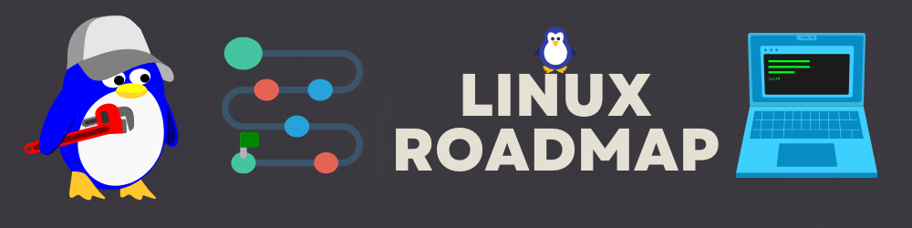

I'm glad you took the chance to learn more about Linux; 

I'll use this opportunity to guide you on the steps required from my experience in order to have a solid foundation in Linux.

Let's put it in steps and i'll link you in each:

### Table of Contents
- [1- Get Familiar With The Command Line](#1--get-familiar-with-the-command-line)
- [2- Permissions and Privileges](#2--permissions-and-privileges)
- [3- Get Familiar with Shell Scripting and Automation](#3--get-familiar-shell-scripting-and-automation)
- [4- Master The Command Line Text Editors](#4--master-the-command-line-text-editors)
- [5- Next-Level Workshops](#5--next-level-workshops)
- [6- EXPLORE MORE](#6--explore-more)

## 1- Get Familiar With The Command Line
- Learn the fundamental commands and structure of the Linux command line. Navigating the file system, manipulating files and directories, and running programs are all component of this. 

You can refer to my article [here](https://blog.yahya-abulhaj.dev/gitgithub-workflow-in-80-seconds#heading-linux-commands). It will also introduce you to GitHub and Git.

## 2- Permissions and Privileges
- Learn and Recognize the significance of file permissions and user management in Linux. 

This is necessary for system security and ensuring that only authorized users have access to specific resources.

## 3- Get Familiar Shell Scripting and Automation
- Learn how to use shell scripts to automate tasks and maintain your system. 

Shell scripts are a powerful tool for combining multiple commands into a single script that can be executed automatically.

I wrote this [article specifically for you](https://blog.yahya-abulhaj.dev/mastering-python-and-bash-for-next-level-automation). It explains a lot about automation, from Bash to Python.

Once finished, you can go further and try some [Shell Exercices from here](https://github.com/Y4HYA4/UniversityLabs/blob/main/TryShellYourself.pdf).

## 4- Master The Command Line Text Editors
Learn how to use the various text editors available in Linux, such as vi and emacs, and become familiar with them.

## 5- Next-Level Workshops
After completing the preceding four points, you should be ready to move on to more advanced scenarios.

NOW, experiment with different commands and options by using the command line.

This is true for these workshops. Here you will become acquainted with applying the above knowledge in real-world scenarios such as OS installation and configuration. You will simuate your own OS as well.

This will help you become more comfortable with using the command line and allow you to better understand how Linux works. Good luck, and remember to enjoy the process.

- Workshop 1: [Configuring and compiling a kernel](workshop1/README.md)
- Workshop 2: [Emulate the Raspberry Pi under Ubuntu with Qemu](workshop2/README.md)
- Workshop 3: [Building an embedded system with the Buildroot project](workshop3/README.md)

DevOps Mindset

The concept of pipelines, represented by the "|" symbol also known as the pipe operator in Linux, is a basic feature of the command line that allows multiple commands to be connected together, where the output of one command is passed as input to the next command. This allows for powerful and flexible automation and data processing.    

  
e.g.

the command `ls -l | grep "txt"` will list all files in the current directory in long format, and then pass the output of that command to the `grep` command, which will search for the string `"txt"` in the output. The command will show only the files that contain the string `"txt"`

### 6- EXPLORE MORE - Never Stop

> [Let's connect](https://www.linkedin.com/in/yahya-abulhaj/)

