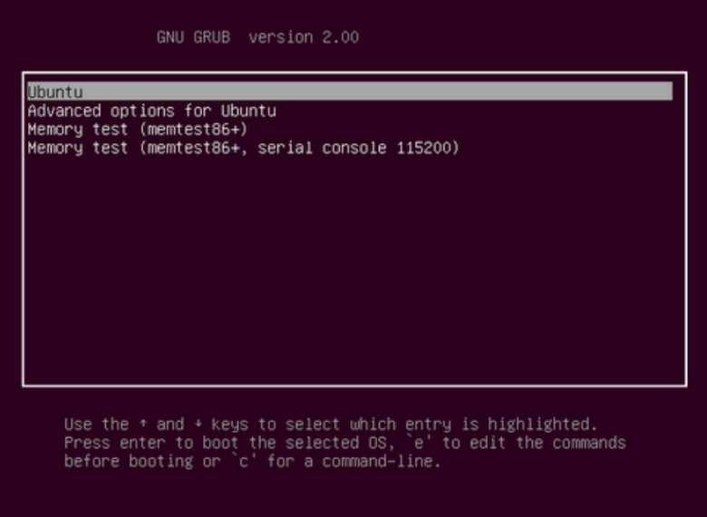

# Workshop 1 
## Workshop Goals
- Download Librairies
- Config Kernel
- Compliation Kernel

## Initial Step

- Create  a folder in which you gonna save the source code.
 
- Download linux version 

```
wget linux-510.11.tar.xz
```


- to start configuration
  
```
make config
```

- to use default config

```
make defconfig
```


- to open config go to folder/compressed source code


```
gedit .config
```


#### Install biblio ncurses


```
sudo apt-get install libncurses5-dev
```

- access to interface of the config (easier)

```
make menuconfig
```

- or use graphical interface (better)

- first install bib

```
sudo apt-get sintall qt4-dev-tools
```
- seond command


```
sudo apt-get install g++
```

- finally open the graphical interface
  
```
make xconfig
```

- do your config and good job!


#### Compile Code


- TO Compile ur code write this command
  
```
make
```

- there will be new file created in urdirectory/linux-version/arch/x86-64/boot

> will be called bzImage (l'image frere)

- Install kernel and required modules

```
sudo make modules_install
```

```
sudo make install
```
> this will create the files containing the kernel in the /boot repo and the files of the modules in repo specific of the kernel version in /lib/modules


#### START THE MACHINE?

- we need initial system file for RAM, go to boot

```
cd boot/
```

- update bootloader grub to add the start menu 

```
sudo update-grub2
```

- reboot!!

```
sudo reboot
```


## You are well set!! 

The screen should launch, click advanced for ubunto and pick the version you installed which is for my case the linux-5.10.11





### Well done!
Move Ahead to the [second workshop](workshop2/README.md)


