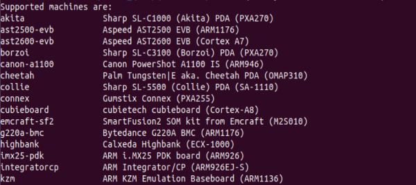
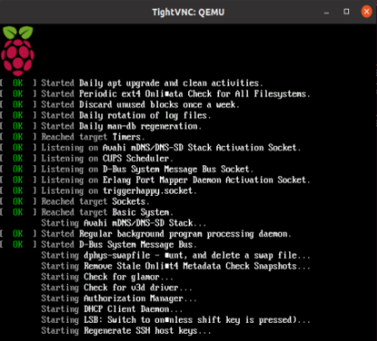
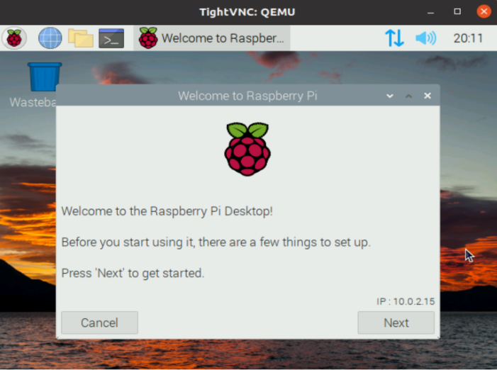

# Workshop 2: Ubunto Raspberry Pi Simulation with Qemu

## Goals
- Install Qemu
- Config Qemu
- Install Raspberry kernel 
- Simulate Raspberry2 with Qemu


## Leap
- go ur repo and install qemu


```
wget https://download.qemu.org/qemu-7.2.0.tar.xz
```


- decompress file


```
tar xvfJ qemu-7.2.0.tar.xz
```

- move to the decompressed file

```
cd qemu-7.2.0
```

- create build in order to construct the code source

```
mkdir build 
```

## Create config QEMU inside build

```
../configure
```

- once config done, compile


```
make 
```


## Install Qemu in BUILD

```
sudo make install
```
- that's it, find where it is


```
locate qemu 
```


```
ls /usr/local/bin/qemu-*
```

- inside build, list all the machines supported by QEMU 


```
qemu-system-arm -machine -help
```




## Install Linux Kernel

go back to the top directory and download raspberry kernel.

```
git clone from gitub
```
or just click from [here](https://www.raspberrypi.com/software/operating-systems/)


- unzip the image of distru rasp dans root direc, you will get (img extension mostly)
  
```
unzip 2023-01-03-raspios-bullseye.armhf-full.zip
```

- Another option to convert it to **qcow2** first.
  

```
qemu-img convert -f raw -O qcow2 2023-01-03-raspios-bullseye.armhf-full.zip
```

- with qcow2 extension we can expand the image.


```
qemu-img resize raspios-armhf-full.qcow +6G
```


## Simulate Raspberry2 with Qemu 

- in root 

```
sudo qemu-system-arm \
```

- open another command window in paralel and run this


```
xtightvncviewer 127.0.0.1:5900
```

- this should open it.


## GOOD GAME


A windows should open with Raspberry Pi UI




Well done!
Move Ahead to the [third workshop](../workshop3/README.md)
