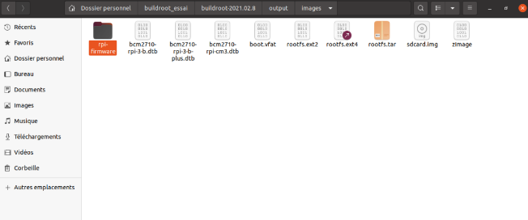
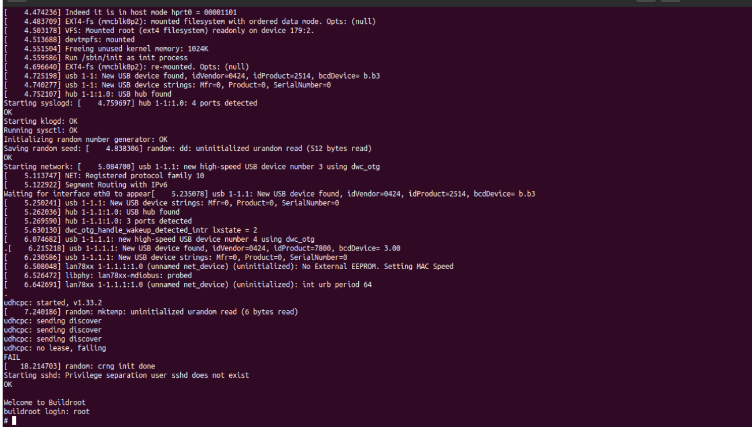
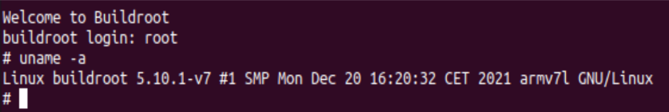
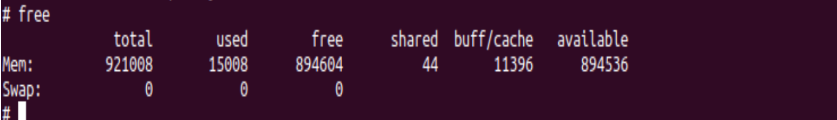
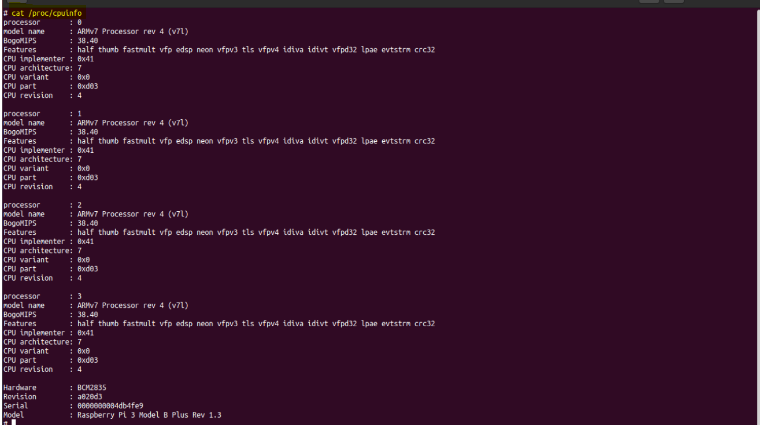

# Workshop 3: Construction of an embedded system with the project Buildroot


# Important chars
Buildroot is technically a set of “Makefiles” defining, in
depending on the options set by the user, how to compile
each package selected with particular options. He builds
finally a complete and coherent distribution of which each component
has been compiled.


To start the process of configuration, run

```
make menuconfig 
```


```
make xconfig)
```

## Toolchain
➢ The toolchain designates the set of tools to be compiled which will then allow
to have an environment capable of cross compiling from the architecture
host (x86_64) to the target architecture (ARM).

➢ The toolchain includes a number of mandatory components
as : <br>
✓ A compiler.<br>
✓ A linker.<br>
✓ An assembler.<br>

➢ Once everything is configured, the configuration tool generates a file
".config" which contains the entire configuration. This file will be read
by the “Makefile” file during the build process.


To start the build process, just run:

```
make
```

### Key points
➢ The main output files of the execution of the “make” command
can be located in the “./output/images” folder.
➢ Buildroot generates a bootloader, a kernel image and a
file system.

➢ The “make” command generally performs the following steps:
- Download source files (if necessary);
- Configuration, compilation and installation of the toolchain
crossed;
- Configuration, compilation, corrections (applying patches) and
installation of selected target packages;
- Construction of an image of the core;
- Building a bootloader image;
- Creation of a root file system (rootfs) in the formats
selected.


# Lab Started

- From a terminal, create a directory in /home/user called
“buildroot_trial” and go to it.

- download latest version of buildroot there:

```
wget https://buildroot.org/dowloads/buildroot-2022.02.8.tar.bz2
```

- decompress **bz2**


```
tar xf buildroot-2022.02.8.tar.bz2
```


- move to it

```
cd buildroot-2022.02.8
```

- We request a default Buildroot configuration for the target
chosen. The available default configurations are visible in the "configs/" subdirectory. We choose the one for Raspberry Pi
3b/3b+:

```
make raspberrypi3_defconfig 
```

- then, execute make


```
make 
```

Buildroot generated new files as required containing the tools u need to generate ur embedded OS




## Buildroot Output

- All the files produced during the compilation are in the “output/” sub-trees:


```
ls output
```

   In “output/images” the compilation result files:

```
ls output/images
```

- We can also observe an “output/target” sub-directory representing the complete tree that we will install on the target.

```
ls output/target

```
As the "output/target" directory contains files that do not have the correct membership, it should not be used blindly, nor copied directly to a target or exported for an NFS root mount. This is what Buildroot reminds us of by creating this famous file.


## Install Boot

- to see all hirerachy, in the buildroot-2022 run


```
lsblk
```

- Insert a micro-SD card on the development computer (for example with a USB adapter), then relaunch the same command to see what
who has appeared.

```
lsblk
```

- Copy the “sdcard.img” file to your SD card using this linux command in the Buildroot folder:

```
sudo dd if=output/images/sdcard.img of=/dev/mmcblk0
```

The copy takes a little while, it's normal, you have to fill a few hundred megabytes. Once the copy is complete, you insert the micro-SD card on a Raspberry Pi 3 to which you are connected by a serial link with a USB-Serial cable of this kind.

<br>
<br>


- we can now see this messages



<br>
<br>

-  We do have a login prompt, and can connect:
  


- The kernel corresponds well to the version indicated above. Let's examine the state of memory:



- we can verify the process of Raspberry Pi3 in the cpuinfo directory


```
cat /proc/cpuinfo
```



## Great, [RedHat is good in the cloud](https://access.redhat.com/documentation/en-us/red_hat_enterprise_linux/7/html/installation_guide/chap-getting-started)
